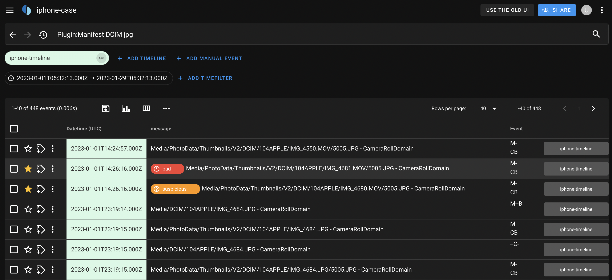

# mvt2ts
A script to convert [Mobile Verification Toolkit (MVT)](https://github.com/mvt-project/mvt/) generated timeline files to a format that can be imported into Google's [Timesketch](https://timesketch.org/) for performing forensic analysis on iPhone or Android devices. 

## Usage
After running MVT, a file is generated called `timeline.csv`. Convert it to a Timesketch compatible import file:

```
❯ ./mvt2ts.py --outfile iphone-timeline.jsonl

Mobile Verification Toolkit (MVT) timeline to Timesketch compatible import file

[+] Converting 'timeline.csv'. Please wait ...

[+] 302139 entries were parsed
[+] 621 entries had no valid timestamp
[+] 302139 events written to file 'iphone-timeline.jsonl'
```

The file can then be imported into Timesketch using `timesketch_importer` or via the Timesketch web interface.
```
timesketch_importer --sketch_name iphone-case iphone-timeline.jsonl
```



